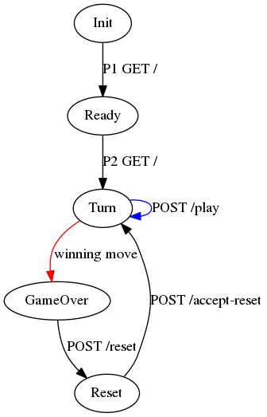

Ultimate Tic-tac-toe Server
===========================

Work in progress.

LAN multiplayer Ultimate tic-tac-toe server in typescript on node.

- Client: node cli app
- Server: node express

Docker
------

    sh docker-build.sh
    sh docker-run.sh server
    host=localhost sh docker-run.sh client

Develop
-------

### Setup ###

Install node with [https://github.com/nvm-sh/nvm](nvm).

    nvm install     # one-time install
    nvm use         # each time you enter the project directory

Install npm packages.

    npm install

### Config ###

The server does not need config, but the client does.
You need to set the `host` environment variable to the host name or ip address of the server.
You can use the .env [https://www.npmjs.com/package/dotenv](dotenv) file to set it.

### Run ###

    npm run server
    npm run client

### Run during dev ###

While developing, you can skip building by using tsnode.
You still need to setup your config as described above.

    npm run server-dev
    npm run client-dev

### Format, lint, build, test ###

    npm run all

### Test coverage ###

    # Run the tests with `npm run all` or
    npm test
    # This will generate the test coverage report
    # Then open the test coverage report
    firefox coverage/lcov-report/index.html

### Generate documentation ###

    npm run doc
    firefox docs/index.html &

### Update dependencies ###

    npm run ncu

Notes
-----

Game Status
- Init
- Ready
- Turn
- GameOver
- Reset

    GameState: {
        player: 1 | 2 | 'spectator',
        state: 'init' | 'ready P1' | 'P1 turn' | 'P2 turn' | 'P1 win' | 'P2 win' | 'tie' | 'P1 reset' | 'P2 reset'
        board: 1-9,
        boards: Board[] // length 9
    }

    Board: {
        status: 'available' | 1 | 2 | 'tie',
        cells: ('E'|'X'|'O')[] // length 9
    }

- R: Board status
    - available: available
    - 1: player 1 won this board
    - 2: player 2 won this board
    - tie: this board is a tie
- C: Board Cell
    - E: Empty
    - X: player 1 has an X here
    - O: player 2 has an O here

Finite State Machine:

